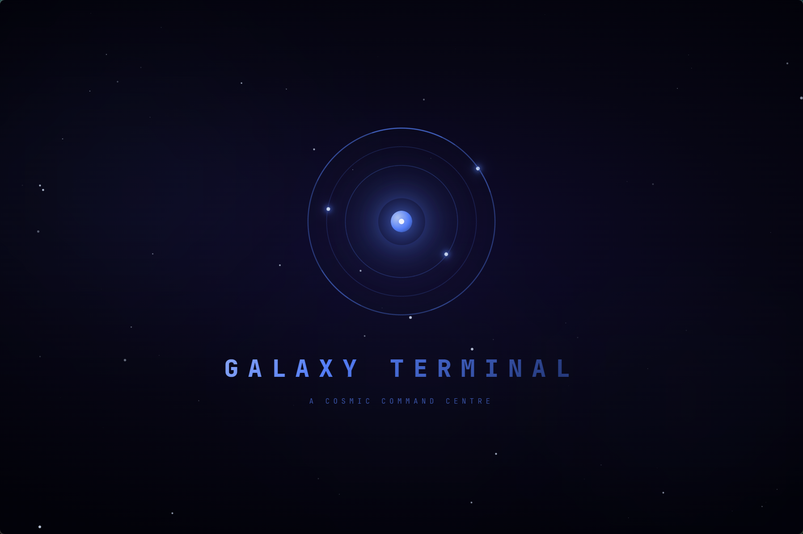
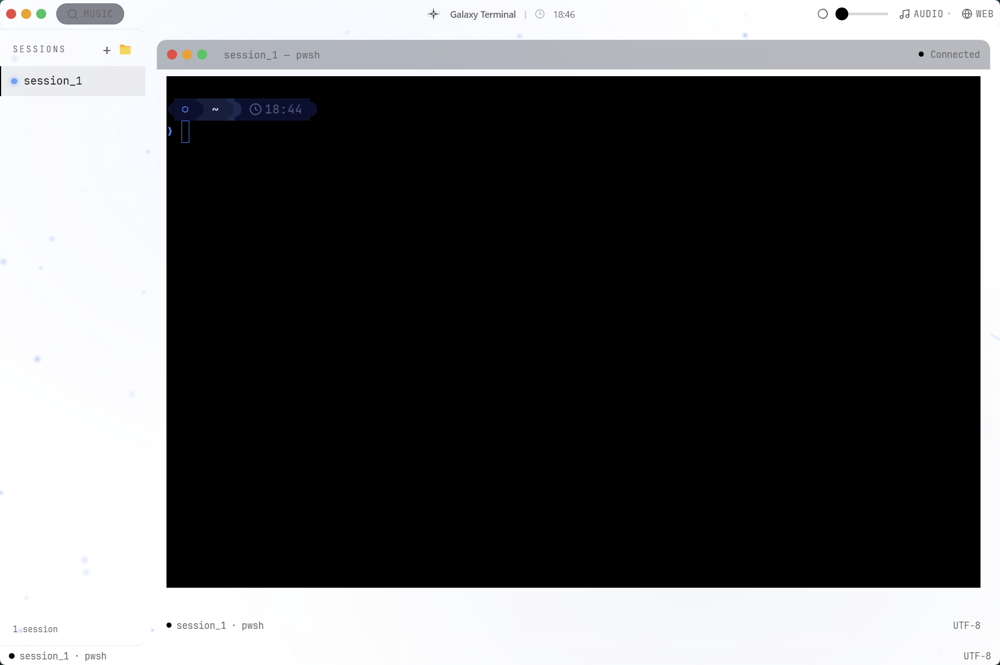
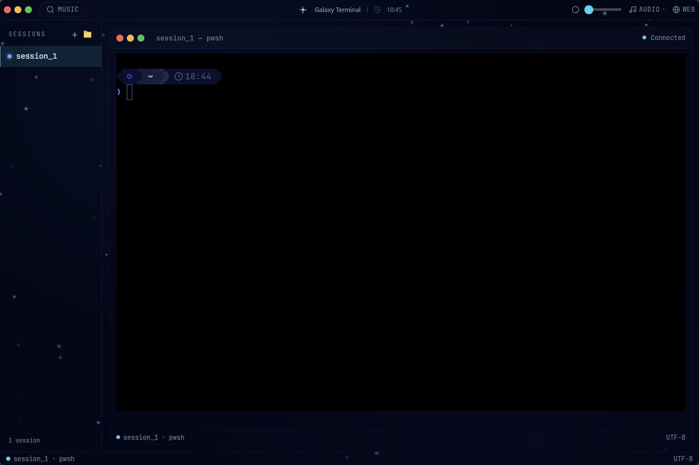
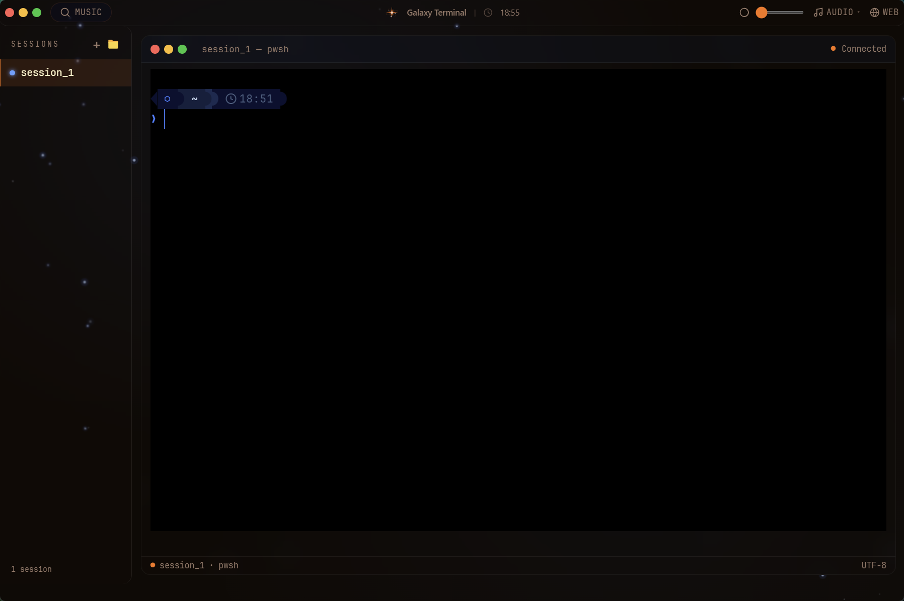
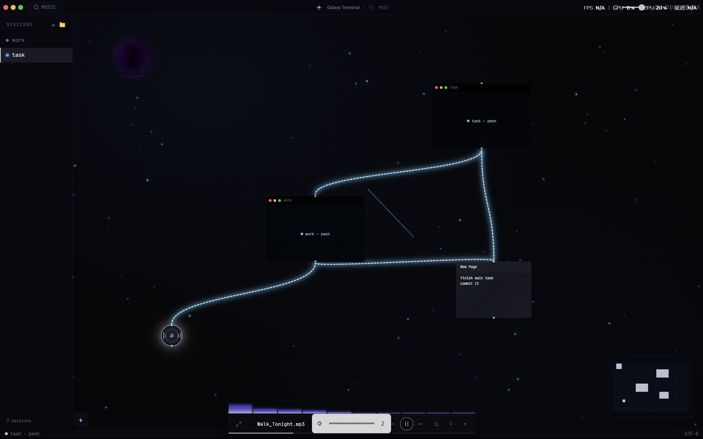
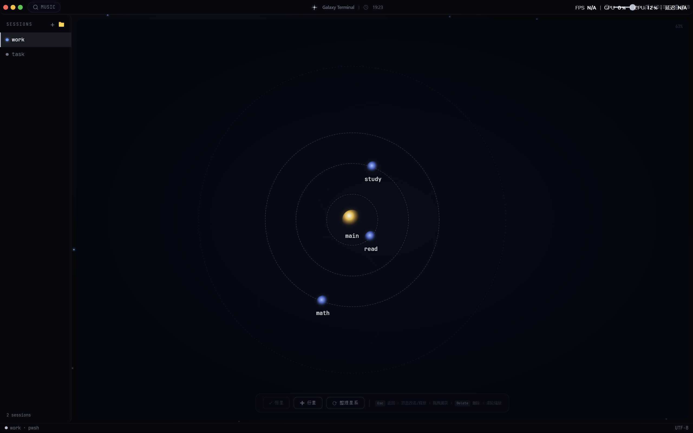
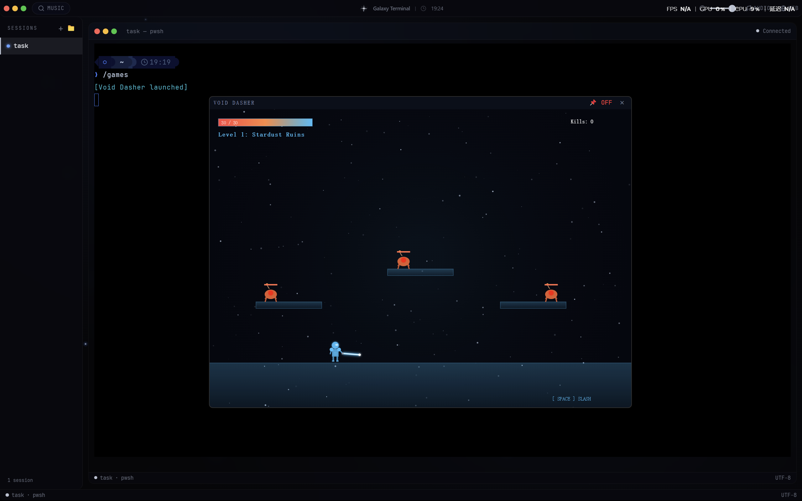

<p align="center">
  
</p>

<h1 align="center">Galaxy Terminal</h1>

<p align="center">
  <strong>🌌 A Cosmic-Themed Desktop Terminal for Windows</strong>
</p>

<p align="center">
  
  
  
  
  
</p>

---

## ✨ Features

- **Real PowerShell PTY** — Full `pwsh.exe` integration via `node-pty`. Not a mock terminal.
- **Cosmic Visuals** — Galaxy starfield background, nebula overlays, scan lines, multi-theme support.
- **Multi-Session Tabs** — Create, switch, rename, and close independent PTY sessions.
- **Command Blocks** — Warp-style visual command/output separation.
- **Galaxy Spotlight** — `Ctrl+K` command palette with `/help`, `/galaxy`, `/canvas`, `/memo` and more.
- **Aether Mind Map** — Visual memo/knowledge graph with orbital planet nodes.
- **Music Search** —  music search & playback from Bilibili, with mini-player.
- **3-Tier Ambient Audio** — Dynamic idle/active/climax background music that responds to typing.
- **Local Music Player** — Play local MP3 files with spectrum visualizer.
- **File Tree Explorer** — Browse directories, double-click to open files.
- **Void Dasher** — Retro arcade mini-game built in.
- **Custom Themes** — Orion, Nebula, and more — switch on the fly.

---

## 🖥️ Screenshots

<p align="center">
  <strong>4 Cosmic Themes</strong>
</p>

<table align="center">
  <tr>
    <td align="center"></td>
    <td align="center"></td>
  </tr>
  <tr>
    <td align="center"></td>
    <td align="center"></td>
  </tr>
</table>

---

## 🎯 Feature Demos

### 🎨 Infinite Canvas
Organize your terminal sessions on an infinite 2D canvas. Drag, zoom, and visually layout multiple session windows just like a designer's artboard.

<p align="center">
  
</p>

### 🧠 Aether Memo
A cosmic mind-mapping tool. Create stars (topics) and orbiting planets (notes), connect ideas with energy beams. Built-in physics simulation makes your knowledge graph come alive.

<p align="center">
  
</p>

### 🎵 Online Music Search
Search and stream music from Websites directly inside the terminal. Browse results, double-click to play, with a built-in mini-player and auto-radio mode for endless discovery.

<p align="center">
  
</p>

### 🕹️ Void Dasher
A retro arcade mini-game built into your terminal. Dodge obstacles in deep space — because even developers need a quick gaming break.

<p align="center">
  
</p>

---

## 🔧 More Features

- **UI Opacity Control** — Fine-tune the transparency of all UI panels and overlays with a slider. Dial in your perfect cosmic immersion.
- **Web Search Bar** — Click the Web button on the menu bar to open a built-in URL bar. Search Google or type any URL — opens in your default browser.
- **3-Tier Audio Engine** — Three ambient sound layers (Deep Space / Particle Stream / Interstellar) with two modes:
  - *Dynamic Mode* — Tiers auto-switch based on your typing speed. Idle for browsing, Climax when coding fast.
  - *Static Mode* — Manually lock a single tier for consistent background vibes.
  - Customize any layer by clicking **Change** and selecting your own MP3.
- **Universal File Opener** — Drag and drop or double-click any file in the built-in File Tree. Supports audio (MP3/WAV/FLAC), video (MP4/MKV), images (PNG/JPG), and text files.

---

## 📦 Download

Download the latest installer from [Releases](https://github.com/asdawdhuw/galaxy-terminal/releases):

- **Galaxy Terminal Setup x.x.x.exe** — NSIS installer, supports custom install path

Or use the portable version from `win-unpacked/` in the release assets.

> **System Requirements**: Windows 10/11 x64. PowerShell 7+ recommended.

---

## 🚀 Quick Start (Development)

```bash
# Clone
git clone https://github.com/asdawdhuw/galaxy-terminal.git
cd galaxy-terminal

# Install dependencies
npm install

# Start dev server (with HMR)
npm run dev

# Build production package
npm run dist
```

---

## 🎮 Built-in Commands

Type these directly in the terminal:

| Command | Action |
|---------|--------|
| `/help` or `/galaxy` | Show available commands |
| `/theme` | Open theme picker |
| `/canvas` | Toggle Multiverse canvas view |
| `/memo` | Toggle Aether mind map |
| `/music` | Open music player |
| `/games` | Launch Void Dasher |
| `/chill` | Toggle chill mode |
| `/focus` | Toggle focus mode |
| `ctrl+S` | Galaxy Spotlight |
| `ctrl+wheel` | Zoom front size |
| `ctrl+F` | Text search |


---

## 🛠️ Tech Stack

| Layer | Technology |
|-------|-----------|
| Shell | Electron 33 |
| Build | electron-vite |
| UI | React 18 + Tailwind CSS 3 |
| Terminal | Xterm.js 6 + node-pty |
| Graphics | Canvas API + Framer Motion |
| Audio | Web Audio API + Stream Protocol |
| Package | electron-builder (NSIS) |

---

## 📁 Project Structure

```
galaxy-terminal/
├── electron/
│   ├── main/index.js          # Main process, PTY, IPC, protocols
│   └── preload/index.js       # Context bridge API
├── src/
│   ├── App.jsx                # Root layout & state
│   ├── components/            # React components
│   │   ├── TerminalCanvas.jsx # Xterm.js mount
│   │   ├── TopMenuBar.jsx     # Menu bar + audio panel
│   │   ├── AetherMap.jsx      # Mind map canvas
│   │   ├── RightMusicSidebar.jsx
│   │   ├── MultiverseView.jsx # Terminal session canvas
│   │   ├── VoidDasher.jsx     # Arcade game
│   │   └── ...
│   ├── hooks/                 # Audio engine, music controller
│   └── assets/                # Images & static resources
├── sound/                     # Default ambient audio files
└── package.json
```

---

## 📄 License

MIT © [asdawdhuw](https://github.com/asdawdhuw)

---

<p align="center">
  <sub>Built with ❤️ and a lot of ☕</sub>
</p>
